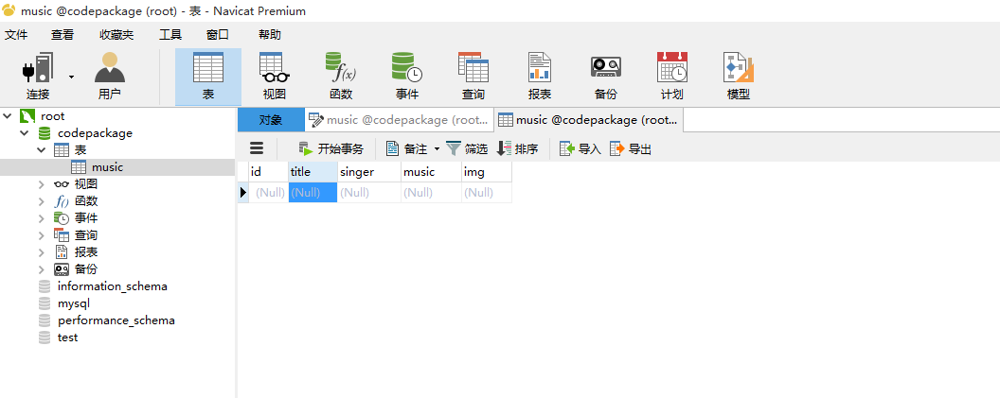

# 音乐列表

## 功能模块

- 首页音乐列表加载
- 添加音乐
- 删除音乐
- 修改音乐


## 第三方模块
```
"dependencies": {
    "art-template": "^3.0.3", // 浏览器端使用的模板引擎
    "body-parser": "^1.15.2", // 解析处理表单 post 请求体
    "bootstrap": "^3.3.7", // UI 框架
    "ejs": "^2.5.2", // 和 Express 结合使用的模板引擎
    "express": "^4.14.0", // 基于node的快速 Web 开发框架
    "formidable": "^1.0.17", // 处理表单文件上传
    "jquery": "^3.1.1", // 前端DOM操作库
    "moment": "^2.15.2", // 处理时间的一个js库
    "mysql": "^2.11.1" // 操作 MySQL 数据库的一个驱动包
  }
```
### 目录结构


### 打开步骤
0. 装node,node版本6.0+
1. 开wampserver，wampserver是一个web开发环境，wampserver自带mysql
2. 装navicat,连接mysql，wampserver默认mysql用户名root，端口3306，密码为空。
navicat是一个数据库管理工具。 


3. 新建数据库，数据库名称是『codepackage』  
  
4. 在数据库下新建一张表，其中id字段设置<font color=red>自动替增、设为主键</font>


5. 保存表，表的名字是『music』


6.『music』文件夹下打开命令窗口，敲 『node app.js』，浏览器地址『http://localhost:3000/』下查看效果
### 效果
#### 添加音乐


#### 修改音乐


## 路由设计

```
GET    /                 渲染首页index.html
GET    /musicList        发送音乐列表数据
GET    /add              渲染添加音乐页面add.html
POST   /add              处理添加音乐请求
GET    /edit?id=xxx      渲染编辑音乐页面edit.html
POST   /edit?id=xxx      处理编辑音乐请求
GET    /remove?id=xxx    处理删除音乐请求
```


### 将代码按功能划分
```
GET    /musicList   从数据库获取数据，渲染页面index.html
GET    /add              渲染添加音乐页面add.html
POST   /add              处理添加音乐请求
GET    /edit?id=xxx      渲染编辑音乐页面edit.html
POST   /edit?id=xxx      处理编辑音乐请求
GET    /remove?id=xxx    处理删除音乐请求
播放音乐
``` 
#### `http://localhost:3000/`，响应首页
```js
// router.js文件代码
router
  // 设置路由
  .get('/', handler.showIndex)

// handler.js文件代码，后台处理代码，具体的路由处理函数
exports.showIndex = (req, res) => {
  res.render('index')
}
```

#### 从数据库获取数据，渲染页面index.html
```js
// router.js文件代码
router
  .get('/musicList', handler.getMusicList)

// db.js文件代码。用到了node-mysql中间件。封装了一个数据库处理方法
const mysql = require('mysql')
// 1. 创建一个连接池
// 数据库的名字是hello
const pool = mysql.createPool({
  // 这里可以配置连接池中的连接对象数量
  connectionLimit: 500,
  host: 'localhost',
  user: 'root',
  password: '',
  database: 'codepackage'
})
exports.query = function(sql, params = [], callback) {
  // 2. 从连接池拿一个可用的连接
  pool.getConnection((err, connection) => {
    if (err) {
      // 这里一般就是拿不到连接对象了才会报错
      // 就是池子里的连接对象用完了
      // 数据库本身也默认有一个最大连接数
      return callback(err)
    }
    // 3. 操作数据库
    connection.query(sql, params, (err, rows) => {
      if (err) {
        return callback(err)
      }
      callback(null, rows)
      // 4. 将连接释放回连接池
      connection.release()
    })
  })
}

// handler.js文件代码
exports.getMusicList = (req, res) => {
  db.query('SELECT * FROM music', (err, rows) => {
    if (err) {
      throw err
    }
    console.log(rows)
    // 返回一个 JSON字符串
    res.json({
      list: rows
    })
  })
}

// index.html文件代码
// 模板文件，arttemplate库渲染模板
<script type="text/template" id="tpl">
  {{ each list as value index }}
  <tr>
    <td>{{index+1}}</td>
    <td>{{value.title}}</td>
    <td>{{value.singer}}</td>
    <td>
      
    </td>
    <td>
      <span data-music="{{value.music}}" class="glyphicon glyphicon-play">
      </span>
    </td>
    <td>
      <a href="/edit?id={{value.id}}">修改</a>
      <a data-id="{{value.id}}" class="remove" href="#">删除</a>
    </td>
  </tr>
  {{/each}}
</script>
// index.html文件代码，ajax请求，根据服务器响应的数据渲染模板
function loadData() {
  $.ajax({
    url: '/musicList',
    type: 'get',
    dataType: 'json',
    success: function(data) {
      // {list: Array[{},{}]}
      // console.log(data)
      // template(id, data)
      // 根据 id 渲染模板。内部会根据document.getElementById(id)查找模板。
      console.log(data)
      $('#tbody').html(template('tpl', data))
    }
  })
}
```

#### 浏览器显示添加页
```
// index.html文件代码
// http://localhost:3000/add
<a class="btn btn-success" href="/add">添加歌曲</a>

// router.js文件代码
router
  // 设置路由
  .get('/add', handler.showAdd)

// handler.js文件代码，具体路由处理函数
exports.showAdd = (req, res) => {
  res.render('add')
}
```

#### 处理添加音乐请求
```js
// add.html文件代码
<!-- 
  复杂表单提交：
    method: post
    enctype: multipart/form-data
 -->
<form action="/add" method="post" enctype="multipart/form-data">
  <div class="form-group">
    <label for="title">标题</label>
    <input type="text" class="form-control" id="title" name="title" placeholder="请输入音乐标题">
  </div>
  <div class="form-group">
    <label for="artist">歌手</label>
    <input type="text" class="form-control" id="singer" name="singer" placeholder="请输入歌手名称">
  </div>
  <div class="form-group">
    <label for="music_file">音乐</label>
    <!-- accept: List of types the server accepts, typically a file type. IE10+-->
    <input type="file" id="music" name="music" accept="audio/*">
    <p class="help-block">请选择要上传的音乐文件.</p>
  </div>
  <div class="form-group">
    <label for="image_file">海报</label>
    <input type="file" id="poster" name="img" accept="image/*">
    <p class="help-block">请选择要上传的音乐海报.</p>
  </div>
  <button type="submit" class="btn btn-success">点击添加</button>
</form>

// router.js文件代码
router
  .post('/add', handler.doAdd)

// handler.js文件代码
// 用到了formidable插件
exports.doAdd = (req, res) => {
  const form = new formidable.IncomingForm()
  form.uploadDir = config.uploadDir // 配置上传文件的路径
  form.keepExtensions = true // 保持扩展名
  form.maxFieldsSize = 20 * 1024 * 1024 // 配置上传文件的大小
  form.parse(req, (err, fields, files) => {
    if (err) {
      throw err
    }
    // 回调函数中的 fields 就是表单中的普通字段
    // files 就是文件信息
    // { title: 'dg', singer: 'hf' }
    // {{music},{img}}
    // console.log(fields)
    // console.log(files)
    const title = fields.title
    const singer = fields.singer
    // F:\05-work\02-codePackage\10BasicalNode\07-Node基础-第7天-2016年10月25日-{Mysql基本使用、sql语句、
    //数据增删改、留言本、网页
    // 版音乐播放器}\musicMyAnalysis\uploads\upload_8aab3ac004b7290f6bccc04953283409.mp3
    // console.log(files.music.path)
    const music = path.basename(files.music.path)
    // upload_8aab3ac004b7290f6bccc04953283409.mp3
    // console.log(music)
    const img = path.basename(files.img.path)
    // 向mysql数据库插入一条数据，引入了db.js文件
    db.query('INSERT INTO music(title, singer, music, img) VALUES(?, ?, ?, ?)', [
      title,
      singer,
      music,
      img
    ], (err, rows) => {
      if (err) {
        throw err
      }
      res.redirect('/')
    })
  })
}
```

#### 渲染编辑音乐页面edit..html
```js
// index.html文件代码
// http://localhost:3000/edit?id=6
<td>
  <a href="/edit?id={{value.id}}">修改</a>
  <a data-id="{{value.id}}" class="remove" href="#">删除</a>
</td>

// router.js文件代码
router
  .get('/edit', handler.showEdit)

// handler.js文件代码
exports.showEdit = (req, res) => {
  const id = req.query.id
  // console.log(id)
  // 按id查询数据库
  db.query('SELECT * FROM music WHERE id=?', [id], (err, rows) => {
    if (err) {
      throw err
    }
    /*[ RowDataPacket {
        id: '1',
        title: '女儿情',
        singer: '万晓利',
        music: 'upload_3c7892ecbd4d0a34945f75f92cc4a9d9.mp3',
        img: 'upload_ae4f4136e27689b81be6d326b7703dc9.jpg' } ]*/
    // console.log(rows)
    res.render('edit', {
      music: rows[0]
    })
  })
}

// edit.html文件代码
// ejs模板引擎渲染
<form id="form" action="/edit?id=<%= music.id %>" method="post">
  <div class="form-group">
    <label for="title">标题</label>
    <input type="text" class="form-control" id="title" name="title"
     placeholder="请输入音乐标题" value="<%= music.title %>">
  </div>
  <div class="form-group">
    <label for="artist">歌手</label>
    <input type="text" class="form-control" id="singer" name="singer" placeholder="请输入歌手名称"
     value="<%= music.singer %>">
  </div>
  <!-- <div class="form-group">
    <label for="music_file">音乐</label>
    <input type="file" id="music_file">
    <p class="help-block">请选择要上传的音乐文件.</p>
  </div>
  <div class="form-group">
    <label for="image_file">海报</label>
    <input type="file" id="image_file">
    <p class="help-block">请选择要上传的音乐海报.</p>
  </div> -->
  <button type="submit" class="btn btn-success">确定修改</button>
</form>
```

#### 处理编辑音乐请求（点击确定修改，提交数据）
```js
// edit.html 文件代码
<form id="form" action="/edit?id=<%= music.id %>" method="post">
  <div class="form-group">
    <label for="title">标题</label>
    <input type="text" class="form-control" id="title" name="title" placeholder="请输入音乐标题"
     value="<%= music.title %>">
  </div>
  <div class="form-group">
    <label for="artist">歌手</label>
    <input type="text" class="form-control" id="singer" name="singer" placeholder="请输入歌手名称"
     value="<%= music.singer %>">
  </div>
  <!-- <div class="form-group">
    <label for="music_file">音乐</label>
    <input type="file" id="music_file">
    <p class="help-block">请选择要上传的音乐文件.</p>
  </div>
  <div class="form-group">
    <label for="image_file">海报</label>
    <input type="file" id="image_file">
    <p class="help-block">请选择要上传的音乐海报.</p>
  </div> -->
  <button type="submit" class="btn btn-success">确定修改</button>
</form>

// edit.html文件代码
$('#form').on('submit', function (e) {
  // 把表单的默认行为干掉，因为提交后要根据服务器返回的数据进行判断后，再进行页面跳转。单纯使用表单默认提交，无法做后续操作。
  e.preventDefault()
  var url = $(this).attr('action')
  var type = $(this).attr('method')
  // 3
  // console.log($(this).serialize())
  $.ajax({
    url: url,
    type: type,
    data: $(this).serialize(),
    dataType: 'json',
    success: function (data) {
      // Object {code: 2000, msg: "uploads success"}
      // 打印了，但是页面又立即跳转了，所以看不到
      // console.log(data)
      var code = data.code
      if (code === 2000) {
        // 删除成功，跳转到首页
        window.location.href = '/'
      } else if (code === 2001) {
        window.alert('更新失败，请重试')
      }
    }
  })
})

// router.js文件代码
router
  .post('/edit', handler.doEdit)

// handler.js文件代码
exports.doEdit = (req, res) => {
  // { id: '5' }
  // console.log(req.query)
  // { title: 'dgf', singer: '电话' }
  // console.log(req.body)
  const id = req.query.id
  // 用到了body-parser中间件
  const title = req.body.title
  const singer = req.body.singer
  // 数据存入数据库之前，一定要做数据安全校验
  // 更新数据库中根据id找到的那一条数据
  db.query('UPDATE music SET title=?, singer=? WHERE id=?', [
    title, singer, id
  ], (err, rows) => {
    if (err) {
      throw err
    }
    if (rows.affectedRows !== 1) {
      return res.json({
        code: 2001,
        msg: 'update failed'
      })
    }
    res.json({
      code: 2000,
      msg: 'uploads success'
    })
  })
}
```
#### 处理删除音乐请求
```js
// index.html文件代码
<a data-id="{{value.id}}" class="remove" href="#">删除</a>
// index.html文件代码
$('body').on('click', '.remove', function(e) {
  if (window.confirm('确定要删除？')) {
    var id = $(this).data('id')
    $.ajax({
      url: '/remove',
      type: 'get',
      data: {
        id: id
      },
      dataType: 'json',
      success: function(data) {
        if (data.code === 1000) {
          loadData()
        } else if (data.code === 1001) {
          window.alert('删除失败')
        }
      }
    })
  }
})

// router.js文件代码
router
  .get('/remove', handler.doRemove)

// handler.js文件代码
exports.doRemove = (req, res) => {
  const id = req.query.id
  db.query('DELETE FROM music WHERE id=?', [id], (err, rows) => {
    if (err) {
      throw err
    }
    if (rows.affectedRows !== 1) {
      // 删除歌曲
      // 1000
      // 1001
      return res.json({
        code: 1001,
        msg: 'remove failed'
      })
    }
    res.json({
      code: 1000,
      msg: 'remove success'
    })
  })
}
```

#### 播放音乐
```js
// index.html文件代码
<audio id="audio" src="uploads/万晓利 - 女儿情.mp3" controls="true"></audio>

// index.html文件代码
// 对于动态加载的内容，记得要使用事件代理的形式注册事件
// 或者将添加事件的行为放到渲染 DOM 之后
$('body').on('click', '.glyphicon-play', function(e) {
  var music = $(this).data('music')
  // upload_b3db892ab168d7a007c597db80102981.mp3
  // console.log(music)
  $('#audio').attr('src', 'uploads/' + music).attr('autoplay', true)
})
```

### 备注
- 数据库id存什么？
数据库开发过程中的一个原则是不应该使用主键来储存“内容”。URL地址并不唯一，可能出现“?”或者“&”甚至于引号等非常规字符，有些字符在改写为URL时还会被转译（例如人民→“%E4%BA%BA%E6%B0%91”），并且有些网站会在URL中添加无意义的随机字符。这些情况使得储存URL的字段会发生重复、不可索引、空值的情况，应当极力避免。应该使用主键来储存“索引”，例如学生的学号，职员的工号，居民身份证号码等等唯一的字符串。如果在设计数据表的过程中并没有符合作为索引的字段，可以专门设置一个自增字段用来作为主键类型int，勾选Auto Increase选项
- 大部分情况下，修改代码后，要在命令行重新输入node app.js重启服务，才能看到修改代码后的效果。命令行按上下键可以快速切换历史命令。
### TODO

1. 点击上传图片按钮，浏览器反应很慢，原因不知道
2. 首页点击播放，音乐已经开始播放了，但是页面图标并没有改变

### 其他
#### MIT，侵权删，代码不是我的，我跟着写了一遍


